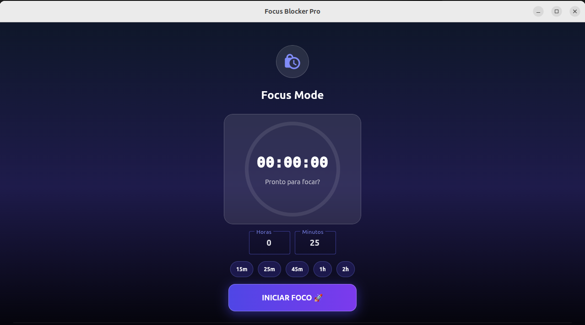
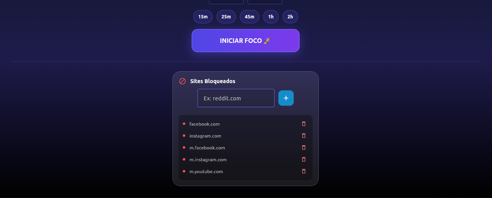

<h1 align="center">
  🎯 Focus Blocker Pro
</h1>

<p align="center">
  <strong>Bloqueie distrações. Foque nos estudos.</strong>
</p>

<p align="center">
  
  
</p>

---

## ✨ Características

| Feature | Descrição |
|---------|-----------|
| 🌙 **Dark Mode** | Interface moderna com tema escuro premium |
| ⏱️ **Timer Visual** | Contagem regressiva em tempo real |
| ⚡ **Atalhos Rápidos** | Botões de 15m, 25m, 45m, 1h, 2h |
| 🔒 **Bloqueio Efetivo** | Modifica `/etc/hosts` para bloqueio total |
| 🔄 **DNS Auto-Flush** | Limpa cache DNS automaticamente |
| 🖥️ **Cross-Platform** | Windows, Linux e macOS |

---

## 🚀 Início Rápido

### Pré-requisitos
- Python 3.12+
- [uv](https://docs.astral.sh/uv/) (gerenciador de pacotes)

### Instalação

```bash
git clone https://github.com/seu-usuario/study-focus-blocker.git
cd study-focus-blocker
uv sync
```

### Execução

**Linux / macOS:**
```bash
sudo .venv/bin/python gui_flet.py
```

**Windows (PowerShell como Admin):**
```powershell
uv run gui_flet.py
```

> ⚠️ **Requer privilégios de administrador** para modificar o arquivo hosts do sistema.

---

## 🎯 Sites Bloqueados

Por padrão, o app bloqueia:

- **YouTube** (youtube.com, youtu.be, m.youtube.com)
- **Instagram** (instagram.com, m.instagram.com)
- **Facebook** (facebook.com, m.facebook.com)
- **WhatsApp Web** (web.whatsapp.com)
- **X / Twitter** (x.com, twitter.com)

Para adicionar mais, edite a lista `SITES_BLOQUEADOS` em `gui_flet.py`.

---

## 🧠 Dica: Técnica Pomodoro

| Fase | Duração |
|------|---------|
| 🍅 Foco | 25 min |
| ☕ Pausa | 5 min |
| 🔁 Repetir | 4x |
| 🌴 Pausa Longa | 15-30 min |

---

<p align="center">
  Feito por felipenvd para estudantes focados.
</p>