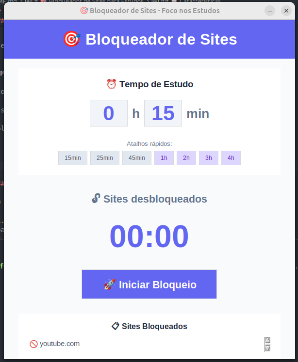

# 🎯 Bloqueador de Sites para Estudos

Um bloqueador de sites simples e eficaz para te ajudar a manter o foco durante sessões de estudo, bloqueando temporariamente sites que causam distrações como YouTube, Instagram e Facebook.

## 📋 Características

- ✅ **Interface Gráfica Moderna** - Design intuitivo e bonito
- ⏰ **Seletor de Horas e Minutos** - Configure tempo em horas e minutos separadamente
- 🚀 **Atalhos Rápidos** - Botões de 15min, 25min, 45min, 1h, 2h, 3h, 4h
- ⏱️ **Timer Visual** - Contagem regressiva em tempo real (HH:MM:SS ou MM:SS)
- 🔒 **Bloqueio Robusto** - Bloqueia YouTube, Instagram, Facebook e todas variações
- 🚫 **Bloqueio Efetivo** - Sites bloqueados mostram erro de conexão (sem bypass)
- 🔄 **Limpeza Automática de DNS** - Cache DNS limpo automaticamente ao bloquear
- 🔓 **Desbloqueio Automático** - Sites liberados após o tempo definido
- ⚡ Leve e sem consumo de recursos
- 🖥️ Funciona em Windows, Linux e macOS
- 🎨 Interface responsiva com efeitos visuais

## 🛠️ Como Funciona

O programa funciona em 2 camadas para garantir bloqueio efetivo:

1. **Modificação do arquivo hosts**: Redireciona domínios bloqueados para `127.0.0.1` (localhost)
2. **Limpeza de cache DNS**: Limpa automaticamente o cache para bloqueio imediato

Quando você tenta acessar sites bloqueados, verá um erro de conexão do navegador, impedindo o acesso completamente.

Quando o tempo termina ou você para o bloqueio, os sites são automaticamente desbloqueados.

## 📦 Requisitos

- Python 3.6 ou superior
- Privilégios de administrador/root

## 🚀 Instalação

1. Clone este repositório:
```bash
git clone https://github.com/seu-usuario/bloqueador-sites.git
cd bloqueador-sites
```

2. Não há dependências externas! O programa usa apenas bibliotecas nativas do Python.

**Arquivos do projeto:**
- `bloqueador_gui.py` - Interface gráfica completa (recomendado)
- `bloqueador.py` - Versão simplificada para terminal
- `README.md` - Documentação

## 💻 Como Usar

### 🎨 Interface Gráfica (Recomendado)

#### Windows

1. Clique com o botão direito no arquivo `bloqueador_gui.py`
2. Selecione **"Executar como administrador"**

**Ou via terminal:**
```bash
# Abra o PowerShell como Administrador
python bloqueador_gui.py
```

#### Linux / macOS

```bash
sudo python3 bloqueador_gui.py
```

### Uso da Interface Gráfica

1. **Defina o tempo**
   - Digite horas e minutos separadamente (ex: 1h 30min)
   - Ou clique nos atalhos rápidos: 15min, 25min, 45min, 1h, 2h, 3h, 4h

2. **Clique em "Iniciar Bloqueio"**
   - Sites são bloqueados imediatamente
   - Cache DNS é limpo automaticamente
   - Pop-up avisa para fechar completamente o navegador

3. **Acompanhe o timer**
   - Visualize o tempo restante em tempo real
   - Formato HH:MM:SS (com horas) ou MM:SS (só minutos)

4. **Teste o bloqueio**
   - Feche e abra o navegador
   - Tente acessar YouTube, Instagram ou Facebook
   - Verá uma página motivacional linda "🎯 Foque nos Estudos!"

5. **Finalize**
   - Sites desbloqueiam automaticamente quando o tempo acaba
   - Ou clique em "Parar Bloqueio" para interromper antes

### 📟 Versão Terminal (Alternativa)

Se preferir usar a versão em linha de comando:

#### Windows
```bash
python bloqueador.py
```

#### Linux / macOS
```bash
sudo python3 bloqueador.py
```

Após executar:
1. Digite quantos minutos você quer estudar
2. Os sites serão bloqueados imediatamente
3. Pressione `Ctrl+C` para interromper antes do tempo

## 📸 Screenshots

### Interface Gráfica



A interface moderna oferece:
- 🎯 **Cabeçalho destacado** com o título do app
- ⏰ **Seletor de horas e minutos** - Campos separados para configuração precisa
- 🚀 **Botões de atalho rápido** - 7 opções pré-configuradas (15min até 4h)
- 📊 **Timer visual grande** - Mostrando tempo restante em HH:MM:SS ou MM:SS
- 🔒 **Status do bloqueio** - Indicador visual em tempo real
- 📋 **Lista completa de sites bloqueados** - Exibe todos os domínios dinamicamente

### Resultado do Bloqueio

Ao tentar acessar sites bloqueados:
- 🚫 **Erro de conexão** - O navegador não consegue acessar o site
- 🔒 **Bloqueio total** - Sem possibilidade de bypass
- ⚡ **Imediato** - Funciona instantaneamente após limpar o cache DNS

### Versão Terminal

```
==================================================
🎯 BLOQUEADOR DE SITES PARA ESTUDOS
==================================================
✅ Sites bloqueados com sucesso!
📚 Foco total nos estudos!

⏰ Quanto tempo você quer estudar?
Digite os minutos (ex: 60): 60

⏳ Sites bloqueados por 60 minutos
💡 Pressione Ctrl+C para desbloquear antes se necessário
```

## 🎯 Sites Bloqueados por Padrão

### YouTube
- youtube.com, www.youtube.com, m.youtube.com
- youtu.be, www.youtu.be

### Instagram
- instagram.com, www.instagram.com, m.instagram.com

### Facebook
- facebook.com, www.facebook.com, m.facebook.com
- web.facebook.com, fb.com, www.fb.com

### WhatsApp
- web.whatsapp.com, www.whatsapp.com, whatsapp.com

### X (Twitter)
- x.com, www.x.com
- twitter.com, www.twitter.com, mobile.twitter.com, m.twitter.com

**Todas as variações são bloqueadas**, incluindo URLs completas como `https://www.youtube.com/`

### Personalizando Sites Bloqueados

Para adicionar ou remover sites, edite a lista `sites_bloqueados` no código:

```python
sites_bloqueados = [
    "www.youtube.com",
    "youtube.com",
    "www.instagram.com",
    "instagram.com",
    # Adicione mais sites aqui
    "twitter.com",
    "www.twitter.com"
]
```

## ⚠️ Avisos Importantes

### Requisitos de Execução
- **Privilégios de Administrador:** O programa precisa de privilégios elevados para:
  - Modificar o arquivo hosts do sistema
  - Limpar cache DNS automaticamente

### Compatibilidade com Navegadores
- ✅ **Feche completamente o navegador** após iniciar o bloqueio
- ✅ **O programa limpa o cache DNS automaticamente** - não precisa fazer manualmente
- ✅ **Pop-up avisa** quando você deve fechar o navegador
- ℹ️ Bloqueio funciona com: Chrome, Firefox, Edge, Safari, Opera, Brave

### Antivírus e Segurança
- **Alguns antivírus podem alertar** sobre modificação do arquivo hosts - isso é normal e seguro
- O programa é 100% open-source - você pode revisar todo o código
- Não coleta dados, não envia informações para internet

## 🧩 Técnicas de Estudo Recomendadas

### Técnica Pomodoro
Use o bloqueador com sessões de:
- 25 minutos de estudo focado
- 5 minutos de pausa
- Repita 4 vezes
- Pausa longa de 15-30 minutos

### Blocos de Estudo Intenso
- 50-60 minutos de estudo profundo
- 10-15 minutos de pausa

## 🤝 Contribuindo

Contribuições são bem-vindas! Sinta-se à vontade para:

1. Fazer um fork do projeto
2. Criar uma branch para sua feature (`git checkout -b feature/NovaFeature`)
3. Commit suas mudanças (`git commit -m 'Adiciona nova feature'`)
4. Push para a branch (`git push origin feature/NovaFeature`)
5. Abrir um Pull Request

## 📝 Melhorias Implementadas e Futuras

### ✅ Já Implementado
- [x] Interface gráfica moderna (GUI) ✨
- [x] Seletor de horas e minutos separados
- [x] Botões de atalho rápido (7 opções)
- [x] Timer visual HH:MM:SS
- [x] Bloqueio robusto via arquivo hosts
- [x] Limpeza automática de cache DNS
- [x] Lista dinâmica de sites bloqueados
- [x] Validações de tempo completas
- [x] Aviso automático para fechar navegador
- [x] Sem dependências externas (apenas Python stdlib)

### 🔮 Próximas Melhorias
- [ ] Configuração via arquivo JSON
- [ ] Estatísticas de tempo de estudo
- [ ] Lista de sites personalizável via interface
- [ ] Modo "trabalho" vs "estudo"
- [ ] Notificações desktop ao finalizar
- [ ] Som ao terminar sessão
- [ ] Histórico de sessões de estudo
- [ ] Gráficos de produtividade
- [ ] Tema escuro/claro
- [ ] Exportar dados de produtividade

## 📄 Licença

Este projeto está sob a licença MIT. Veja o arquivo `LICENSE` para mais detalhes.

## 🙏 Agradecimentos

Desenvolvido para estudantes que querem melhorar seu foco e produtividade! 📚✨

---

**Dica:** Use com disciplina! O bloqueador é uma ferramenta, mas a verdadeira mudança vem do seu compromisso com os estudos. 💪